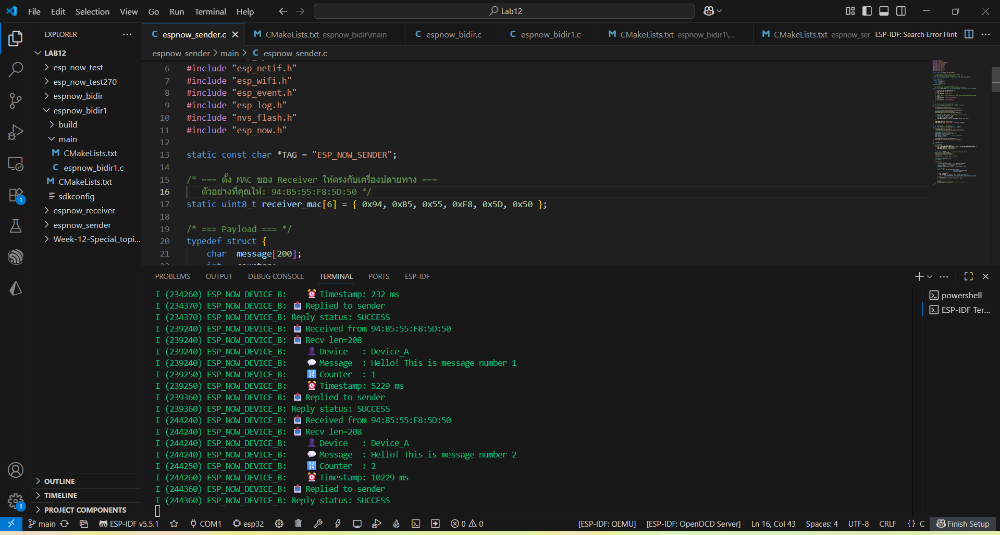
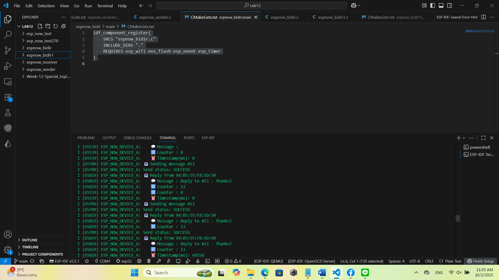

# ESP-NOW สำหรับ ESP32 ด้วย ESP-IDF
การเตรียม ESP-NOW Components
 

ESP-NOW Point-to-Point Communication
 

Two-Way Communication
 

Challenge 1: Remote LED Control
 

Challenge 2: Sensor Data Collection
 

Challenge 3: Two-Way Chat System
 