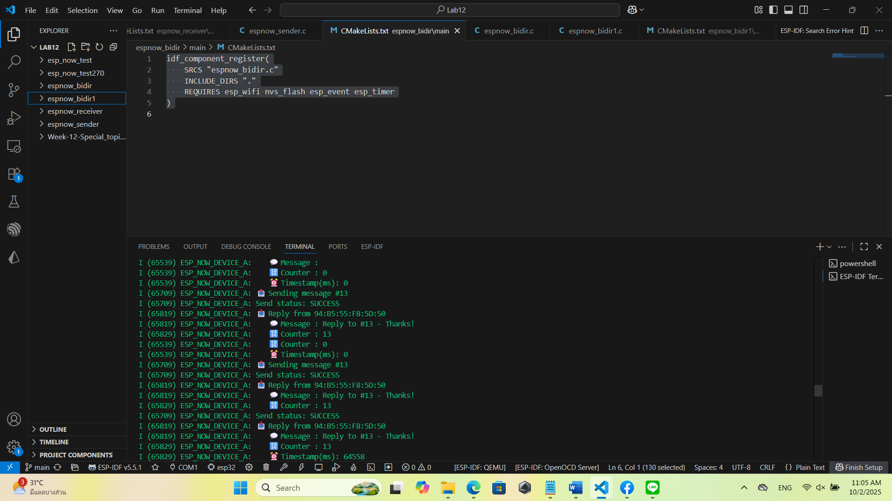
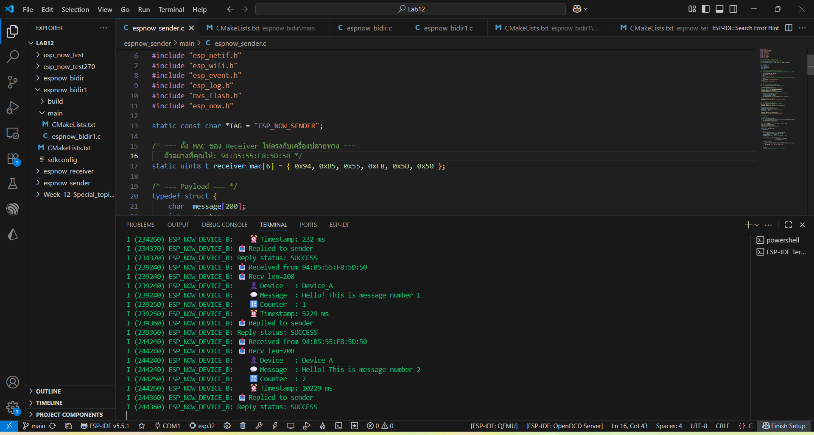

# ESP-NOW สำหรับ ESP32 ด้วย ESP-IDF
การเตรียม ESP-NOW Components

ESP-NOW Point-to-Point Communication

Two-Way Communication

Challenge 1: Remote LED Control

Challenge 2: Sensor Data Collection

Challenge 3: Two-Way Chat System

Broadcaster+Receiver Nodes (Client Nodes)

